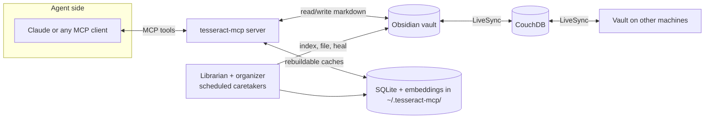
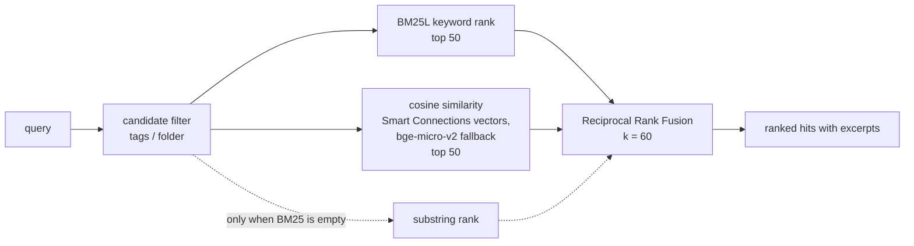

# tesseract-mcp

**A persistent, shared mind for AI agents, built on an Obsidian vault.**

Every Claude session — on any machine — reads from and writes to the same
knowledge base: a plain-markdown Obsidian vault replicated by Self-hosted
LiveSync (CouchDB). This MCP server is how agents search it, extend it, and
keep it organized.


## How it works



The vault's markdown is the single source of truth. Everything the server
computes — the search index, embeddings, the graph cache — lives under
`~/.tesseract-mcp/` and is rebuildable from the vault on demand, so it never
has to travel through LiveSync itself.

## What's inside

### Hybrid search
BM25 keyword ranking and embedding cosine similarity, fused with Reciprocal
Rank Fusion — rank-based fusion means the two score spaces never need to be
normalized against each other. Vectors reuse Obsidian's Smart Connections
embeddings when fresh, with a same-model local fallback (bge-micro-v2) so the
similarity space is never mixed.

### A semantic knowledge graph (GraphRAG)
An LLM pass extracts people, organizations, domains, topics, projects and
sources from notes into real markdown entity notes under `Claude/Graph/` —
visible in Obsidian's graph, synced like everything else, and mirrored into
SQLite for traversal. `related_notes` walks entity chains between notes;
`context_bundle` composes hybrid search and graph context in one call.

### A write contract agents can't break
Agents write freely only under `Claude/` (sessions, concepts, inbox, tasks,
decisions, graph). Everything else is the human's: readable always, writable
only with explicit confirmation — enforced in code, not by convention. The
human-readable rules live in the vault as a constitution.

### An autonomous organizer
New notes are filed into the existing folder taxonomy by embedding
neighbor-vote (≥0.7 agreement moves the note; less queues a human proposal).
Every move is journaled and reversible.

### The Librarian
A single scheduled caretaker loop (`python -m tesseract_mcp.librarian <vault>`)
runs indexing, organizing, cache maintenance, throttled consolidation
proposals, and health checks in one pass — replacing separate indexer and
organizer cron jobs. Sweep reports land in `Claude/Librarian.md`; the
`librarian_status` MCP tool reads the last run.

### One-command vault provisioning
`python -m tesseract_mcp.provision <path-to-vault>` installs a pinned plugin
set, seeds settings (embed model pinned to what the search stack reads), and
installs the agent conventions tree. `--check` reports version drift.

### The recall harness
Four Claude Code skills turn the vault into a memory you can question:
`/recall` (researched answers, every claim cited as a `[[wikilink]]`),
`/digest` (the review ritual), `/resume` (project briefings), and
`/connections` (graph serendipity). `/recall` files every answer into
`Claude/Answers/`, where the Librarian indexes it like any note — so
answers become retrieval sources and the vault compounds from asking
questions, not just ingesting. Skills live in [`skills/`](skills/) and
install with `python -m tesseract_mcp.skill_sync` (additive; `--check`
reports drift; existing skills are never modified without `--force`).

## How retrieval works



Every query runs both rankers over the filtered candidate set, and RRF merges
them by rank position — so BM25 scores and cosine similarities never need to
be normalized against each other. The substring ranker is a fallback signal
for queries BM25's tokenizer can't match (single characters, punctuation),
never a third competitor. Full detail in
[ARCHITECTURE.md](docs/ARCHITECTURE.md).

## Measured retrieval quality

| success@5 | success@10 | recall@5 | recall@10 | MRR |
|---|---|---|---|---|
| 0.88 | 0.94 | 0.88 | 0.94 | 0.89 |

Sixteen golden queries — keyword, paraphrase, title, tag, entity, and
degenerate-input traps — run against the production `hybrid_search` path with
real bge-micro-v2 embeddings over the synthetic 20-note corpus committed in
[`evals/`](evals/README.md) (synthetic because this repo is public; a private
golden set lives in the vault itself). Reproduce with
`python -m tesseract_mcp.evals`.

## Tools

| | Tool | Purpose |
|---|---|---|
| **Orient** | `onboard` | Call first in a new session — constitution, routing, cheat-sheet, graph status |
| **Retrieve** | `search_brain` | Hybrid search (BM25 + vector, RRF-fused), optional tag/folder filters |
| | `context_bundle` | One call: search hits + their graph entities + related notes |
| | `recall_bundle` | Digest/resume raw material for the recall skills — one read-only call |
| | `read_note` | Read any note |
| | `query_notes` | Query notes by frontmatter metadata |
| | `get_backlinks` | Notes whose `[[wikilinks]]` point at a note |
| | `list_recent` | Recently modified notes |
| | `list_tasks` | Checkbox tasks across the vault |
| **Write** | `log_session` | Session log into `Claude/Sessions/` |
| | `capture` | Quick thought into `Claude/Inbox/` |
| | `upsert_concept` | Evergreen notes in `Claude/Concepts/` |
| | `write_note` | General write — quarantined to `Claude/` unless confirmed |
| | `add_task` | Checkbox task in `Claude/Tasks.md` (Obsidian Tasks format) |
| **Graph** | `index_brain` | Extract entities from new/changed notes |
| | `find_entity` | Look up entities by name/alias |
| | `related_notes` | GraphRAG: notes connected via shared entities, with the chain |
| | `graph_stats` | Entity/edge/mention counts |
| | `consolidate_graph` | Merge duplicate entities (dry-run default) |
| **Organize** | `organize_vault` | Autonomous filing sweep (dry-run default) |
| | `librarian_status` | Last caretaker sweep + health report (read-only) |
| | `undo_move` | Revert a journaled move |

## Quickstart

```powershell
git clone <repo> ; cd tesseract-mcp
python -m venv .venv
.venv\Scripts\pip install -e .

# Provision a fresh vault (plugins, settings, conventions)
python -m tesseract_mcp.provision <path-to-vault>

# Register the curated MCP server set (tesseract + web/paper ingest)
$env:TESSERACT_VAULT_PATH = "<path-to-vault>"
.venv\Scripts\python -m tesseract_mcp.mcp_sync
```

The manifest lives in `mcp-servers.json`; sync is additive-only (existing
entries are never modified or removed).

Then open the vault once in Obsidian (disable Restricted Mode, complete
LiveSync setup) and run the `index_brain` tool.

## Scheduled maintenance

The Librarian is the single scheduled task for vault upkeep:

```powershell
python -m tesseract_mcp.librarian <path-to-vault>
```

It drains the index backlog, runs the organizer sweep, rebuilds the graph
cache when needed, proposes consolidation merges (dry-run only), and writes
a health report to `Claude/Librarian.md`. Use `librarian_status` to read
the last sweep without running it.

**First run against a real vault must use `--dry-run`** and be human-reviewed
before scheduling unattended applies — same operational rule as the
organizer. Dry-run prints the formatted report and JSON result without
writing state, moves, or throttle baselines.

Model selection for the `claude` extractor backend (ignored by `codex`):

| Env var | Default | Used for |
|---|---|---|
| `TESSERACT_EXTRACT_MODEL` | `haiku` | Per-note entity extraction |
| `TESSERACT_CONSOLIDATE_MODEL` | `sonnet` | Consolidation merge proposals |

## Going deeper

- [Architecture deep dive](docs/ARCHITECTURE.md) — retrieval pipeline,
  graph design, module map.
- [Server deployment](server/DEPLOY.md) — CouchDB + Caddy for LiveSync.
