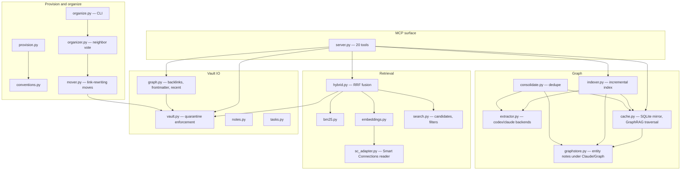
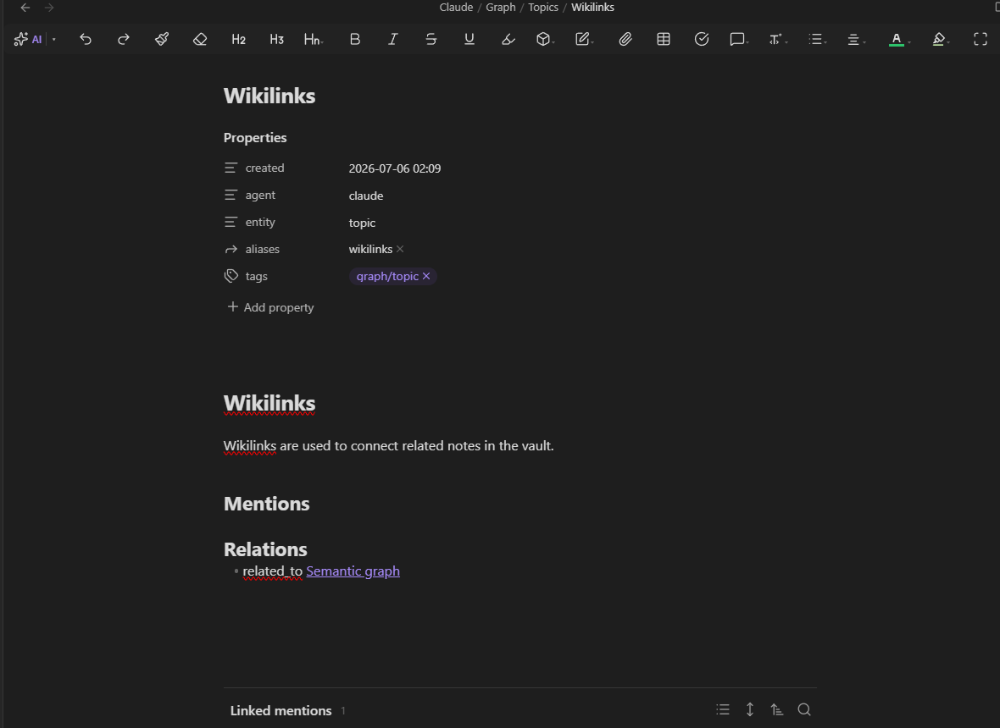

# Architecture

This is a tour of how tesseract-mcp is put together, module by module. It
assumes you've read the [README](../README.md) pitch; this doc goes one
layer deeper into *how* each feature works and why it's built that way.

## 1. System overview

`src/tesseract_mcp/` is organized in four layers: the MCP surface that
Claude talks to, retrieval, the semantic graph, and vault I/O — plus a
provisioning/organizing layer that operates the vault itself.

`server.py` is a thin FastMCP wrapper: it registers 20 tools and delegates
every one of them to a plain-Python function in one of the other modules.
None of the interesting logic lives in `server.py` itself — that keeps the
MCP-specific plumbing (decorators, docstrings-as-tool-descriptions) separate
from behavior that's tested directly against `Vault` objects and temp
directories.

## 2. The retrieval pipeline

`search_brain` and `context_bundle` both go through `hybrid.hybrid_search`,
which runs three independent ranking passes over the same candidate set and
fuses them:

- **Candidate set.** `search.iter_candidate_notes` walks the vault, applies
  the optional tag/folder filters, and skips `.obsidian`, `.trash`, and
  `.git` (`search.SKIP_DIRS`). Every ranking pass below only ever sees this
  filtered set.
- **BM25 ranking.** `bm25.rank` tokenizes with a simple `[a-z0-9]+` regex
  and scores the candidates with `rank_bm25`'s `BM25L` variant (chosen over
  the more common `BM25Okapi` because Okapi's IDF term collapses to zero
  scores on the small corpora typical of a personal vault). The top 50
  positively-scored notes become the BM25-ranked list.
- **Vector ranking.** Every candidate's embedding is compared to the query
  embedding by cosine similarity; the top 50 with positive similarity form
  the vector-ranked list.
- **Fusion.** The two ranked lists are merged with Reciprocal Rank Fusion
  (`hybrid.rrf_fuse`, `k=60`). RRF combines lists by rank position rather
  than raw score, so BM25 scores and cosine similarities — two numbers on
  completely different scales — never need to be normalized against each
  other before they can be compared.
- **Substring fallback — only when BM25 is empty.** BM25 tokenizes on
  `[a-z0-9]+`, so a query that's a single character or pure punctuation
  never token-matches anything and BM25 returns an empty list. Only in that
  case does a third, alphabetically-ordered substring-match list join the
  fusion. The code comment explains why this is gated rather than always
  included: *"When BM25 has results, the alphabetically-ordered substring
  list would just pollute the fusion."* Substring matching is a fallback
  signal for degenerate queries, not a fourth ranking strategy competing
  with BM25 and vectors on equal footing.
- **Vector source.** Vectors come from Obsidian's Smart Connections plugin
  (`sc_adapter.py`) when its cached embedding for a note is fresh — i.e.
  computed after the note's last edit. When Smart Connections' embedding is
  stale or absent, `embeddings.py` falls back to a local
  `sentence-transformers` model, `TaylorAI/bge-micro-v2`, and caches the
  result (keyed by content hash) in `fallback_embeddings.json` next to the
  rest of this vault's state. That fallback model is not an arbitrary
  choice: it's pinned to be *identical* to what Smart Connections uses,
  because embedding vectors from two different models live in unrelated
  vector spaces — mixing them into one similarity ranking would silently
  corrupt it.
- **Indexing keeps the cache warm; search isn't fully exempt.**
  `indexer.run` calls the same `embeddings.get_note_vectors` function that
  `hybrid_search` calls, right after each incremental indexing pass — so
  immediately after an `index_brain` run, every note's vector is already
  cached and a search usually just reads it back. But `get_note_vectors` is
  not purely read-only: for any note edited *since* the last indexing pass
  (whose Smart Connections vector also isn't fresh), the fallback-cache
  content hash no longer matches, and `search_brain` / `context_bundle`
  will synchronously call the embedder inline for that note before ranking
  proceeds. In practice, only notes changed since the last `index_brain`
  run pay this cost — everything else is served from cache.

## 3. The semantic graph

Entity notes are **real markdown files**, not a hidden database. Extraction
writes them under `Claude/Graph/`, split by type into `People/`,
`Organizations/`, `Domains/`, `Topics/`, `Projects/`, and `Sources/`
(`graphstore.TYPE_FOLDERS`). Because they're ordinary notes, they show up in
Obsidian's own graph view, sync to every machine via LiveSync exactly like
the rest of the vault, and can be hand-edited without breaking anything.

Alongside the markdown, a SQLite database (`graph.db`, under
`~/.tesseract-mcp/`) mirrors the same information for fast traversal
queries — joins and multi-hop walks that would be painful to do by
re-parsing markdown on every call. This mirror is fully derived from the
`Claude/Graph/` notes and rebuilt with `cache.rebuild` whenever needed; it
is never the source of truth.

- **Extraction.** `indexer.run` hash-diffs the vault against a manifest and
  only sends *new or changed* notes through extraction — a full LLM pass
  over an unchanged vault costs nothing. Extraction itself is delegated to
  `extractor.CliExtractor`, which shells out to either the `codex` or the
  `claude` CLI, selected by the `TESSERACT_EXTRACTOR` environment variable
  (`codex` is the default). Both backends are given the same prompt asking
  for entities (typed as person / organization / domain / topic / project /
  source) and relations between them, returned as JSON; malformed replies
  get one repair retry before failing that note.
- **Traversal.** `related_notes` (backed by `cache.related_notes`) starts
  from the entities a given note mentions and walks the entity graph
  outward for a configurable number of `hops`, returning every other note
  connected through that chain along with a human-readable description of
  the chain itself (e.g. `Note A — (works_at) Acme — (operates_in) Cloud
  Infra`). `context_bundle` composes this with hybrid search in a single MCP
  call: it runs `search_brain`, collects every entity mentioned by the hits,
  and returns their `related_notes` alongside the hits — so a client doesn't
  need three separate round-trips to assemble GraphRAG-style context.
- **Consolidation.** LLM extraction inevitably produces near-duplicate
  entities ("Oracle VM" vs. "Oracle VM deploy"). `consolidate.py` gathers
  every entity note, asks the extractor backend to propose merge groups,
  and — dry-run by default — only actually folds duplicates into a
  canonical entity (rewriting mentions, relations, and aliases, and leaving
  a `merged_into` stub behind) when called with `apply=True`.

## 4. The write contract

Every write goes through `vault.Vault`, and two rules are enforced there in
code, not left to convention: no path may resolve outside the vault root,
and any write to a path outside `Claude/` requires the caller to pass
`confirm_outside_claude=True`. `write_note` is the only tool that exposes
this flag, and the tool's own docstring instructs the calling model to set
it "ONLY when the user explicitly asked for the write." Every other write
tool (`log_session`, `capture`, `upsert_concept`, `add_task`, entity/graph
writes) targets a fixed path under `Claude/` and never needs the flag at
all.

The human-readable half of this contract lives *in* the vault itself, as a
constitution at `Claude/README.md` — rules for what agents should and
shouldn't do, written for a human to read and edit directly in Obsidian.
Connecting MCP clients get a short version of the same orientation for free
through the server's `instructions` string (shown to every client on
connection); the `onboard` tool goes further and returns the full
constitution text, a vault-guide file, and a tool cheat-sheet in one call,
so a fresh agent session can orient itself before writing anything.

## 5. The organizer

`organizer.py` implements a scheduled, mostly-autonomous filing pass over
the vault's top-level folders.

- **Taxonomy discovery.** The taxonomy isn't hard-coded: `discover_taxonomy`
  just lists the vault's existing top-level directories, minus three
  hard-excluded categories. First, a fixed set of named directories that are
  never topical: `Claude` (agent-owned, out of the organizer's scope
  entirely), `00 - Maps of Content` (Obsidian's map-of-content convention),
  and infrastructure/tooling dirs `.obsidian`, `.smart-env`, `.trash`,
  `.space`, and `copilot` (`organizer.EXCLUDED_DIRS`). Second, a catch-all:
  *any* other directory starting with `.` is treated as config/tooling and
  excluded regardless of name. Third, a fixed set of vault-root agent guide
  files (`CLAUDE.md`, `AGENTS.md`, `README.md`) that Claude and Codex read
  directly from the vault root and must never be moved.
- **The vote.** Each candidate note's embedding is compared against every
  already-organized note's embedding; the top-K (K=10) most similar notes
  vote for their own top-level folder, weighted by cosine similarity. If the
  winning folder's share of that vote is **≥ 0.7**, the note moves there
  automatically. Below that threshold, what happens depends on where the
  note already sits: an unfiled, vault-root note is queued as a proposal in
  `Claude/Organizer.md` for a human to review and act on manually, while a
  note that's already filed inside a taxonomy folder is left exactly where
  it is — a low-confidence disagreement about an already-filed note is
  silently skipped rather than surfaced as a proposal.
- **Safe moves.** Applying a move is delegated to `mover.py`, which rewrites
  every path-qualified `[[wikilink]]` that pointed at the note's old
  location (bare `[[Stem]]` links are untouched, since the organizer refuses
  to move a note if that would create a duplicate filename elsewhere in the
  vault) and transfers its entry in the indexing manifest so the note isn't
  needlessly re-extracted. Every move — automatic or via `undo_move` — is
  appended to a journal (`organizer_journal.jsonl`) and mirrored as a
  human-readable log line in `Claude/Organizer.md`; `undo_move` reads the
  journal to restore the file, reverse the link rewrites, and mark the
  entry undone.
- **Running it.** The scheduled/autonomous entry point is the CLI:
  `python -m tesseract_mcp.organize <vault> [--dry-run]`. Its default
  behavior is to *apply* moves — that's the intended unattended path — but
  the very first run against any real vault must be done with `--dry-run`
  and the output reviewed by a human before ever letting it apply.

## 6. Sync & storage

The vault's markdown is the single source of truth for everything: notes,
entity graph, tasks, the organizer's log. Every other file the server
produces — the BM25-adjacent search index (rebuilt fresh per query, not
persisted at all), the fallback embedding cache, and the `graph.db` SQLite
mirror — lives under `~/.tesseract-mcp/` and is derived, disposable state.
Delete that entire directory and running `index_brain` (or
`python -m tesseract_mcp.indexer <vault> --rebuild-only`) rebuilds it from the
markdown alone; nothing is lost.

That separation is what makes sync simple: Self-hosted LiveSync, backed by
a CouchDB instance, replicates the vault's markdown — including
`Claude/Graph/`, since entity notes are just notes — to every machine that
has the vault open. The disposable caches under `~/.tesseract-mcp/` never
need to sync at all; each machine rebuilds its own. The server-side
infrastructure for that CouchDB instance (a Docker Compose stack fronted by
Caddy for TLS) lives in `server/`; see [`server/DEPLOY.md`](../server/DEPLOY.md)
for how to stand it up.

## 7. Module map

| Module | Responsibility |
|---|---|
| `bm25.py` | In-memory BM25 keyword ranking over vault notes, rebuilt fresh per query rather than persisted. |
| `cache.py` | Derived SQLite cache over the `Claude/Graph` markdown, rebuildable anytime. |
| `consolidate.py` | LLM-driven consolidation of duplicate graph entities. |
| `conventions.py` | Installs the `Claude/` conventions tree (constitution, seed notes, root guides) into a vault; idempotent. |
| `embeddings.py` | Vector source for hybrid search: Smart Connections' embeddings where fresh, a same-model local fallback (cached) where stale or missing. |
| `extractor.py` | LLM entity extraction via pluggable CLI backends (`codex` / `claude`). |
| `graph.py` | Vault metadata queries: frontmatter filtering, wikilink backlinks, recent files. |
| `graphstore.py` | Markdown-native graph store: reads and writes entity notes under `Claude/Graph/`. |
| `hybrid.py` | Hybrid retrieval: BM25 keyword ranking + vector similarity, fused via Reciprocal Rank Fusion. |
| `indexer.py` | Incremental vault indexing: hash-diff manifest → extract → store → cache. |
| `mover.py` | Moves a vault note while keeping every inbound link resolvable. |
| `notes.py` | Structured note operations for the `Claude/` subtree (sessions, inbox captures, concepts). |
| `organize.py` | CLI entry point for the autonomous filing sweep (`python -m tesseract_mcp.organize`). |
| `organizer.py` | Autonomous vault organizer: files notes where their semantic neighbors live, via cosine-weighted K-nearest-neighbor folder vote. |
| `provision.py` | Provisions a fresh Obsidian vault as a Tesseract mind database (plugins, settings, conventions). |
| `sc_adapter.py` | Reads Smart Connections' local embeddings directly from disk. |
| `search.py` | Full-text search across the vault; also the shared candidate-filtering logic used by hybrid search. |
| `server.py` | FastMCP server exposing the Tesseract vault to Claude. |
| `tasks.py` | Task operations compatible with the Obsidian Tasks plugin format. |
| `vault.py` | Filesystem access to the Obsidian vault with safety rules (path containment, `Claude/` write quarantine). |
