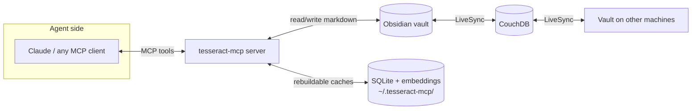

# Documentation Overhaul (README + ARCHITECTURE) Implementation Plan

> **For agentic workers:** REQUIRED SUB-SKILL: Use superpowers:subagent-driven-development (recommended) or superpowers:executing-plans to implement this plan task-by-task. Steps use checkbox (`- [ ]`) syntax for tracking.

**Goal:** Replace the terse operator README with a public/portfolio-quality `README.md` plus a `docs/ARCHITECTURE.md` deep dive, with Mermaid diagrams and curated Obsidian screenshots.

**Architecture:** Pure documentation change — two markdown files and an assets directory. Every factual claim is verified against the code in `src/tesseract_mcp/` (not restated from old specs). Screenshots are captured last, via computer use, with per-image human review before commit.

**Tech Stack:** GitHub-flavored Markdown, Mermaid (GitHub-native rendering), computer-use screenshots.

## Global Constraints

- Spec: `docs/superpowers/specs/2026-07-09-readme-architecture-docs-design.md` — follow it exactly.
- Audience is a stranger on GitHub. No machine-specific paths in commands: use `<path-to-vault>` / `<repo>` placeholders. One clearly-marked example block may show a concrete Windows path.
- Never mention unfinished work (the LiveSync warning) anywhere in the docs.
- Screenshot redaction rules are hard requirements: no LiveSync warning banner, no readable personal content (`Job Search/` etc.), no sync popups. Unframeable shot ⇒ ship placeholder slot instead.
- All 20 MCP tools must appear in the README tools table, exactly the set registered in `src/tesseract_mcp/server.py`: `onboard`, `search_brain`, `context_bundle`, `read_note`, `query_notes`, `get_backlinks`, `list_recent`, `list_tasks`, `log_session`, `capture`, `upsert_concept`, `write_note`, `add_task`, `index_brain`, `find_entity`, `related_notes`, `graph_stats`, `consolidate_graph`, `organize_vault`, `undo_move`.
- Verified retrieval facts to state (do not soften or embellish):
  - Hybrid search = BM25 (rank-bm25) + vector cosine similarity, fused with **Reciprocal Rank Fusion (k=60)** — rank-position fusion, so scores never need cross-normalization (`hybrid.py`).
  - Substring ranking joins the fusion **only when BM25 returns nothing** (queries BM25's `[a-z0-9]+` tokenizer can't match) (`hybrid.py:95-100`).
  - Vectors come from **Smart Connections' own embeddings when fresh**, with a **same-model local fallback** (TaylorAI/bge-micro-v2 via sentence-transformers) cached in `fallback_embeddings.json`; mixing models would corrupt the similarity space, hence the pin (`embeddings.py`, `sc_adapter.py`).
  - Embedding freshness is precomputed during incremental indexing.
  - SQLite caches live under `~/.tesseract-mcp/` and are rebuildable from the vault; markdown is the single source of truth.

---

### Task 1: Rewrite README.md

**Files:**
- Modify: `README.md` (full rewrite)
- Create: `docs/assets/.gitkeep`

**Interfaces:**
- Consumes: nothing.
- Produces: `README.md` with two HTML comment markers Task 3 will replace: `<!-- SCREENSHOT: hero-graph -->` and section links to `docs/ARCHITECTURE.md` (file created in Task 2 — a dangling relative link for one commit is acceptable).

- [ ] **Step 1: Write the verification checks first (they should FAIL against the current README)**

Run these; all three should show the OLD README failing the new requirements:

```powershell
# a) All 20 tool names present? (currently fails: table exists but check the exact set)
$tools = 'onboard','search_brain','context_bundle','read_note','query_notes','get_backlinks','list_recent','list_tasks','log_session','capture','upsert_concept','write_note','add_task','index_brain','find_entity','related_notes','graph_stats','consolidate_graph','organize_vault','undo_move'
$readme = Get-Content README.md -Raw
$tools | Where-Object { $readme -notmatch "``$_``" }
# b) No machine-specific paths? (currently fails: README contains C:\Users\Taimoor)
Select-String -Path README.md -Pattern 'C:\\Users\\Taimoor'
# c) Mermaid diagram present? (currently fails: no mermaid block)
Select-String -Path README.md -Pattern '```mermaid'
```

Expected now: (a) may return empty, (b) returns a match (bad), (c) returns nothing (bad).

- [ ] **Step 2: Write the new README.md**

Structure and required content (write real prose around this skeleton; keep total length ≈ 2 screens):

````markdown
# tesseract-mcp

**A persistent, shared mind for AI agents, built on an Obsidian vault.**

Every Claude session — on any machine — reads from and writes to the same
knowledge base: a plain-markdown Obsidian vault replicated by Self-hosted
LiveSync (CouchDB). This MCP server is how agents search it, extend it, and
keep it organized.

<!-- SCREENSHOT: hero-graph -->

## How it works



## What's inside

### Hybrid search
BM25 keyword ranking and embedding cosine similarity, fused with Reciprocal
Rank Fusion — rank-based fusion means the two score spaces never need to be
normalized against each other. Vectors reuse Obsidian's Smart Connections
embeddings when fresh, with a same-model local fallback (bge-micro-v2) so
similarity space is never mixed.

### A semantic knowledge graph (GraphRAG)
An LLM pass extracts people, organizations, domains, topics, projects and
sources from notes into real markdown entity notes under `Claude/Graph/` —
visible in Obsidian's graph, synced like everything else, and mirrored into
SQLite for traversal. `related_notes` walks entity chains between notes;
`context_bundle` composes hybrid search + graph context in one call.

### A write contract agents can't break
Agents write freely only under `Claude/` (sessions, concepts, inbox, tasks,
decisions, graph). Everything else is the human's: readable always, writable
only with explicit confirmation — enforced in code, not by convention. The
human-readable rules live in the vault as a constitution.

### An autonomous organizer
New notes are filed into the existing folder taxonomy by embedding
neighbor-vote (≥0.7 agreement moves the note; less queues a human proposal).
Every move is journaled and reversible.

### One-command vault provisioning
`python -m tesseract_mcp.provision <path>` installs a pinned plugin set,
seeds settings (embed model pinned to what the search stack reads), and
installs the agent conventions tree. `--check` reports version drift.

## Tools

| | Tool | Purpose |
|---|---|---|
| **Orient** | `onboard` | Call first in a new session — constitution, routing, cheat-sheet, graph status |
| **Retrieve** | `search_brain` | Hybrid search (BM25 + vector, RRF-fused), optional tag/folder filters |
| | `context_bundle` | One call: search hits + their graph entities + related notes |
| | `read_note` | Read any note |
| | `query_notes` | Query notes by frontmatter metadata |
| | `get_backlinks` | Notes whose `[[wikilinks]]` point at a note |
| | `list_recent` | Recently modified notes |
| | `list_tasks` | Checkbox tasks across the vault |
| **Write** | `log_session` | Session log into `Claude/Sessions/` |
| | `capture` | Quick thought into `Claude/Inbox/` |
| | `upsert_concept` | Evergreen notes in `Claude/Concepts/` |
| | `write_note` | General write — quarantined to `Claude/` unless confirmed |
| | `add_task` | Checkbox task in `Claude/Tasks.md` (Obsidian Tasks format) |
| **Graph** | `index_brain` | Extract entities from new/changed notes |
| | `find_entity` | Look up entities by name/alias |
| | `related_notes` | GraphRAG: notes connected via shared entities, with the chain |
| | `graph_stats` | Entity/edge/mention counts |
| | `consolidate_graph` | Merge duplicate entities (dry-run default) |
| **Organize** | `organize_vault` | Autonomous filing sweep (dry-run default) |
| | `undo_move` | Revert a journaled move |

## Quickstart

```powershell
git clone <repo> ; cd tesseract-mcp
python -m venv .venv
.venv\Scripts\pip install -e .

# Provision a fresh vault (plugins, settings, conventions)
python -m tesseract_mcp.provision <path-to-vault>

# Register with Claude Code
claude mcp add --scope user tesseract `
  -e TESSERACT_VAULT_PATH=<path-to-vault> `
  -- <repo>\.venv\Scripts\tesseract-mcp.exe
```

Then open the vault once in Obsidian (disable Restricted Mode, complete
LiveSync setup) and run the `index_brain` tool.

## Going deeper

- [Architecture deep dive](docs/ARCHITECTURE.md) — retrieval pipeline,
  graph design, module map.
- [Server deployment](server/DEPLOY.md) — CouchDB + Caddy for LiveSync.
````

Keep the existing organizer/provisioner CLI details that the old README had **only if they fit the flow**; operational detail beyond quickstart belongs in ARCHITECTURE.md §5/§6 (Task 2). The `<!-- SCREENSHOT: hero-graph -->` marker stays as an HTML comment until Task 3.

- [ ] **Step 3: Create the assets directory**

```powershell
New-Item -ItemType Directory -Force docs\assets | Out-Null
New-Item -ItemType File docs\assets\.gitkeep
```

- [ ] **Step 4: Re-run the Step 1 checks — all must now pass**

Expected: (a) empty output — all 20 tools present; (b) no matches — no personal paths; (c) one match — mermaid block present. Also verify no mention of LiveSync warning: `Select-String -Path README.md -Pattern 'warning'` returns nothing.

Then confirm every command the quickstart names actually exists:

```powershell
Select-String -Path pyproject.toml -Pattern 'tesseract-mcp = '     # entry point exists
.venv\Scripts\python -c "import tesseract_mcp.provision"           # expect: no error
.venv\Scripts\python -c "import tesseract_mcp.organize"            # expect: no error
.venv\Scripts\python -c "import tesseract_mcp.indexer"             # expect: no error
```

- [ ] **Step 5: Sanity-check the Mermaid block**

Paste the mermaid block into https://mermaid.live (or rely on a GitHub branch preview) and confirm it renders with no parse error. If editing the diagram, keep node labels free of unescaped `(`/`)` inside `[...]` — Mermaid parses them as shape syntax.

- [ ] **Step 6: Commit**

```powershell
git add README.md docs/assets/.gitkeep
git commit -m "docs: rewrite README as public product-style front page"
```

---

### Task 2: Write docs/ARCHITECTURE.md

**Files:**
- Create: `docs/ARCHITECTURE.md`

**Interfaces:**
- Consumes: README links to `docs/ARCHITECTURE.md` (Task 1).
- Produces: `docs/ARCHITECTURE.md` with marker `<!-- SCREENSHOT: entity-note -->` for Task 3.

- [ ] **Step 1: Write the verification checks (should FAIL — file doesn't exist)**

```powershell
Test-Path docs\ARCHITECTURE.md                       # expect: False
```

- [ ] **Step 2: Write docs/ARCHITECTURE.md**

Seven sections per the spec. Required skeleton and facts (expand into prose; verify each claim against the cited file before writing it):

````markdown
# Architecture

## 1. System overview

```mermaid
flowchart TB
    subgraph MCP surface
        server[server.py — 20 tools]
    end
    subgraph Retrieval
        hybrid[hybrid.py — RRF fusion]
        bm25[bm25.py]
        emb[embeddings.py]
        sca[sc_adapter.py — Smart Connections reader]
        search[search.py — candidates, filters]
    end
    subgraph Graph
        indexer[indexer.py — incremental index]
        extractor[extractor.py — codex/claude backends]
        graph[graph.py — traversal]
        gstore[graphstore.py — SQLite mirror]
        consolidate[consolidate.py — dedupe]
    end
    subgraph Vault IO
        vault[vault.py — quarantine enforcement]
        notes[notes.py]
        tasks[tasks.py]
        cache[cache.py]
    end
    subgraph Provision and organize
        provision[provision.py]
        conventions[conventions.py]
        organize[organize.py — CLI]
        organizer[organizer.py — neighbor vote]
        mover[mover.py — link-rewriting moves]
    end
    server --> hybrid --> bm25 & emb & search
    emb --> sca
    server --> graph --> gstore
    server --> indexer --> extractor & gstore
    server --> vault
    hybrid --> vault
    organizer --> mover --> vault
```

## 2. The retrieval pipeline
- Candidate set: `search.iter_candidate_notes` applies tag/folder filters and SKIP_DIRS.
- BM25 ranking over candidates (top 50).
- Vector ranking: cosine similarity against note vectors, top 50, positive-similarity only.
- Fusion: Reciprocal Rank Fusion, k=60 — explain why rank fusion avoids score normalization.
- Substring fallback: appended as a THIRD ranked list ONLY when BM25 is empty
  (BM25 tokenizes [a-z0-9]+; single-char/punctuation queries fall through).
  Quote the code comment's rationale: when BM25 has results, the
  alphabetically-ordered substring list would pollute the fusion.
- Vector source: Smart Connections embeddings when fresh; same-model fallback
  (TaylorAI/bge-micro-v2) cached in fallback_embeddings.json. State the
  invariant: vectors from different models live in unrelated spaces — the
  fallback model is pinned to what Smart Connections uses.
- Freshness: precomputed during incremental indexing so search never blocks
  on embedding staleness checks.

## 3. The semantic graph
- Entity notes as REAL markdown under Claude/Graph/ (People/, Organizations/,
  Domains/, Topics/, Projects/, Sources/) — visible in Obsidian, synced by
  LiveSync, rebuildable SQLite mirror in ~/.tesseract-mcp/.
<!-- SCREENSHOT: entity-note -->
- Extraction: indexer processes new/changed notes only; backend selected by
  TESSERACT_EXTRACTOR=codex|claude.
- Traversal: related_notes walks shared-entity chains (hops parameter);
  context_bundle = hybrid search + entities of hits + related notes in one call.
- Consolidation: consolidate.py merges alias/duplicate entities, dry-run default.

## 4. The write contract
- Quarantine enforced in vault.py: writes outside Claude/ require
  confirm_outside_claude — code, not convention.
- The constitution lives in the vault (Claude/README.md); connecting clients
  get orientation via MCP instructions; onboard returns the full guide.

## 5. The organizer
- Taxonomy discovery from existing top-level folders; hard exclusions:
  dot-directories, vault-root agent guides.
- Cosine-weighted neighbor vote; share ≥ 0.7 moves, below queues a proposal
  in Claude/Organizer.md.
- mover.py rewrites qualified wikilinks and transfers manifests; every move
  journaled with a human-readable mirror; undo_move reverts.
- CLI: python -m tesseract_mcp.organize <vault> [--dry-run]. First run
  against a real vault MUST be --dry-run and human-reviewed.

## 6. Sync & storage
- Markdown vault = single source of truth. SQLite + embedding caches under
  ~/.tesseract-mcp/ are disposable: delete them and index_brain rebuilds.
- LiveSync (CouchDB) replicates the vault — including Claude/Graph/ — to
  every machine; server infra in server/ (compose file, Caddyfile), see
  server/DEPLOY.md.

## 7. Module map
| Module | Responsibility |
(one row per file in src/tesseract_mcp/, one line each — write from the
module docstrings, not from memory)
````

- [ ] **Step 3: Verify**

```powershell
Test-Path docs\ARCHITECTURE.md                        # expect: True
Select-String -Path docs\ARCHITECTURE.md -Pattern '```mermaid' | Measure-Object | Select-Object -ExpandProperty Count   # expect: >= 1
# Module map covers every source file:
(Get-ChildItem src\tesseract_mcp\*.py -Exclude __init__.py).BaseName | Where-Object { (Get-Content docs\ARCHITECTURE.md -Raw) -notmatch $_ }   # expect: empty
Select-String -Path docs\ARCHITECTURE.md -Pattern 'C:\\Users\\Taimoor'   # expect: nothing
```

Also render the section-1 Mermaid block (mermaid.live or GitHub preview) — subgraph titles with spaces must be quoted if the renderer complains.

- [ ] **Step 4: Commit**

```powershell
git add docs/ARCHITECTURE.md
git commit -m "docs: add architecture deep dive (retrieval pipeline, graph, contracts)"
```

---

### Task 3: Capture and place Obsidian screenshots

**Files:**
- Create: `docs/assets/hero-graph.png`, `docs/assets/entity-note.png` (optional third: `docs/assets/organizer-proposals.png`)
- Modify: `README.md` (replace `<!-- SCREENSHOT: hero-graph -->`), `docs/ARCHITECTURE.md` (replace `<!-- SCREENSHOT: entity-note -->`)

**Interfaces:**
- Consumes: the two HTML comment markers from Tasks 1–2.
- Produces: final committed docs.

**This task requires computer use on the user's desktop and a HUMAN REVIEW GATE before commit. It cannot be delegated to a worktree subagent — execute it in the main session.**

- [ ] **Step 1: Prepare Obsidian for capture**

Via computer use: open Obsidian on the Tesseract vault. Dismiss/avoid any LiveSync warning banner or sync popups (do NOT attempt to fix LiveSync — out of scope). Close personal notes; open Graph view.

- [ ] **Step 2: Capture the shots per the redaction rules**

Shot list and framing:
1. `hero-graph.png` — Graph view, whole vault or filtered to `Claude/Graph/` (graph search filter `path:Claude/Graph`). Zoom so cluster structure is visible but individual personal note titles in other clusters are not readable. No banner, no popups, no `Job Search/` titles readable.
2. `entity-note.png` — an entity note under `Claude/Graph/` (pick an impersonal one, e.g. a Domain or Topic entity) showing frontmatter + typed wikilinks.
3. Optional `organizer-proposals.png` — `Claude/Organizer.md` if it contains no personal note titles; otherwise skip.

Save captures into `docs/assets/` with those exact names. If any shot cannot satisfy the rules, skip it and leave the marker as a placeholder comment.

- [ ] **Step 3: HUMAN REVIEW GATE**

Show each captured image to the user and get explicit approval per image before staging. Any rejected image: recapture or drop to placeholder.

- [ ] **Step 4: Wire images into the docs**

In `README.md` replace `<!-- SCREENSHOT: hero-graph -->` with:

```markdown

```

In `docs/ARCHITECTURE.md` replace `<!-- SCREENSHOT: entity-note -->` with:

```markdown

```

(Note the differing relative paths — README is at repo root, ARCHITECTURE.md is inside docs/.)

- [ ] **Step 5: Verify**

```powershell
Select-String -Path README.md,docs\ARCHITECTURE.md -Pattern 'SCREENSHOT:'   # expect: nothing (or only deliberately-kept placeholders)
Test-Path docs\assets\hero-graph.png   # expect: True (if approved)
```

Confirm image paths resolve in a GitHub branch preview (relative links are case-sensitive on GitHub).

- [ ] **Step 6: Commit (only after the review gate)**

```powershell
git add docs/assets README.md docs/ARCHITECTURE.md
git commit -m "docs: add reviewed vault screenshots to README and architecture"
```
